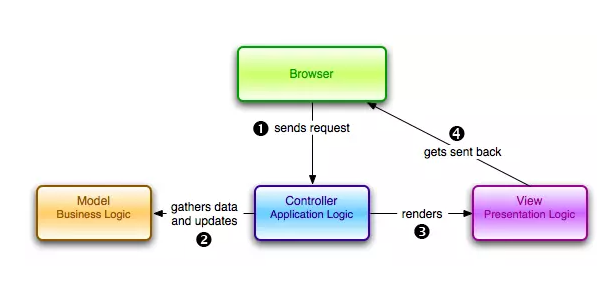
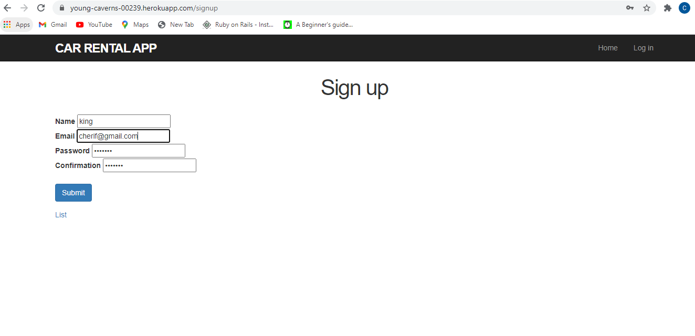

# Introduction to ruby on rails
## Overview
This guide is designed for beginners who want to get started with learning about  Rails. It does not assume that you have any prior experience with Rails. But rather that you have learned the basics of HTML/CSS/JS and Ruby, Ruby algorithms and Git / Github.in this guide there is useful knowledge and guidance about how to start developing with rails framework, however if you want to dive more into web development with rails you will need to get your hands dirty and further your knowledge. some of the materials that can help you are suggested in this documentation.  By the end of this guide  learners will be able to:

1. Understand well what is rails.
2. Mvc(model view controller) architecture and how it is related to ruby  on rails.
3. Understand database concept and how they relate to rails.
4. what is heroku?  and ways to deploy an app on heroku.

## What is Rails?

**Rails** is a web application development framework written in the Ruby programming language. It is designed to make programming web applications easier by making assumptions about what every developer needs to get started. It allows you to write less code while accomplishing more than many other languages and frameworks.

The Rails philosophy includes two major guiding principles:

**Don't Repeat Yourself**: DRY is a principle of software development which states that "Every piece of knowledge must have a single, unambiguous, authoritative representation within a system." By not writing the same information over and over again, our code is more maintainable, more extensible, and less buggy.

**Convention Over Configuration**: Rails has opinions about the best way to do many things in a web application, and defaults to this set of conventions, rather than require that you specify minutiae through endless configuration files.

It is highly recommended that you familiarize yourself with Ruby before diving into Rails. You will find it much easier to follow what’s going on with a Rails application if you understand basic Ruby syntax. 
To develop a web application using Ruby on Rails Framework, you need to install the following software:

- Ruby
- The Rails Framework
- A Web Server
- A Database System

**To do:** checkout the tools listed below and look into them; in order to extend your knowledge about the basics of ruby rails
Rails provides a full stack of components for creating web applications, below are handful of tools you need to familiarize yourself with for better future development with ruby on rails.

- Action Controller
- Action View
- Active Record
- Action Mailer
- Active Resource
- Railties
- Active Support

### **See also:** 
[Recommended learning materials](https://guides.rubyonrails.org/v2.3/getting_started.html)

## Mvc architecture

In this part, we’re going to learn a little more about the MVC, the system Architecture at the core of the Rails Framework for Software Development. Hopefully, by the end of it, you’ll know why working with system architecture can make all the difference when developing an app.

**MVC** is a pattern for the architecture of a software application. It separates an application into the following components:
**Models** for handling data and business logic
**Controllers** for handling the user interface and application
**Views** for handling graphical user interface objects and presentation
This separation results in user requests being processed as follows:
The browser (on the client) sends a request for a page to the controller on the server.
The controller retrieves the data it needs from the model in order to respond to the request.
The controller gives the retrieved data to the view.
The view is rendered and sent back to the client for the browser to display.

**Let’s picture this scenario…**
We’ve built an app that has only one button. This button, when pressed, shows user data like name, email, and age. Now, let’s figure out the MVC structure of this app:

For the **View**, we have the user interface with a button and a table in which the user info will be displayed.
For the **Controller**, we have the method show user,that calls the database info on the user and sends it to the view.
For the **Model**, we have a User class that will generate a User table in the database (with each row of this database corresponding to a user) and retrieve an object of that class whenever asked by the Controller.

Rails promotes the concept that models, views, and controllers should be kept separate by storing the code for each element as separate files in separate directories.

**Rails scaffolding** is a quick way to generate some of the major pieces of an application. If you want to create the models, views, and controllers for a new resource in a single operation, scaffolding is the tool for the job.

### **See also:** 
[Recommended learning materials](https://www.freecodecamp.org/news/understanding-the-basics-of-ruby-on-rails-http-mvc-and-routes-359b8d809c7a/)

## Database knowledge

A **database** is an organized collection of structured information, or data, typically stored electronically in a computer system. A database is usually controlled by a database management system (DBMS).
With ruby on rails database works hand in hand with active record.
**Active Record** is the **M** in **MVC** - the model - which is the layer of the system responsible for representing business data and logic. Active Record facilitates the creation and use of business objects whose data requires persistent storage to a database.
Rails uses ActiveRecord to function as a bridge between the database and Ruby code.

Ruby on Rails recommends to create three databases - a database each for development, testing, and production environment.

Each ActiveRecord object has Create, Read, Update and Delete methods for database access. This characteristic allows Ruby on Rails applications to have straightforward mappings between applications objects and database tables. ActiveRecord does away with the need to use SQL in most cases. It is compatible with different databases such as MySQL, SQLite, and PostgreSQL. Irrespective of the database you are using, ActiveRecord method format remains the same.

We use SQL language to manipulate the data. Let’s get the basics.

1. **GET**: if we want to get all data (person) from People table, we need to select it from that table.
2. **DELETE**: we want to delete all data from our People table.
3. **INSERT**: we will insert/store data into the table.
4. **UPDATE**: we have stored the data, but we want to update it.

Ruby on Rails recommends to create three databases - a database each for development, testing, and production environment.

The development environment is used on your development computer as you interact manually with the application
The test environment is used to run automated tests
The production environment is used when you deploy your application for the world to use.

Below are Additional codes that you may need to get familiar with, on your journey to learn rails.

- Rails db:create
- Rails db:migrate
- Rails db:drop
- Rails db:reset

### **See also:** 
[Recommended learning materials](https://guides.rubyonrails.org/v2.3/getting_started.html)

## Heroku web deployment

**Heroku** is a platform as a service based on a managed container system, with integrated data services and a powerful ecosystem, for deploying and running modern apps. 

Heroku is known for running apps in dynos – which are really just virtual computers that can be powered up or down based on how big your application is.
Heroku calls these instances dynos; these are lightweight containers that each run a single command for your app. In my experience as a beginner building apps that only perform one action, I’ve never had more than one dyno per app.

Below I attached a ruby on rails app that I deployed on heroku. Amazing isn’t it?

One of the reasons Heroku is easy for people to use is that it relies on a widely used revision control system—that is, a way of managing the program code for your app—called Git. If you’re not already familiar with Git, 
you might want to review  [learn more about git/github](https://readwrite.com/2013/09/30/understanding-github-a-journey-for-beginners-part-1/)

In fact, you can’t deploy an app on Heroku unless you are using Git to manage your app clode. The “push” command, “Heroku push master,” is what you input on the command line to send the app from your repository to the cloud. That’s why Heroku is considered a “one click” deploy.

### How to deploy  an app on heroku?
If you haven't already, log in to your Heroku account and follow the prompts to create a new SSH public key.

- $ heroku login

Clone the repository

Use Git to clone young-caverns-00239's source code to your local machine.

- $ heroku git:clone -a young-caverns-00239
- $ cd young-caverns-00239

Deploy your changes
Make some changes to the code you just cloned and deploy them to Heroku using Git.

- $ git add .
- $ git commit -am "make it better"
- $ git push heroku master

### **See also:** 
[Recommended learning materials](https://devcenter.heroku.com/articles/git)

## conclusion

This marks the end of this documentation , I hope you did benefit a lot from it and that it helped you on your journey to study ruby on rails. There is still a lot to learn and the more you dig deeper the more fun rails gets. Ruby on rails is one of the kind framework that can develop 
prototypes as quickly  as it gets.The strength of the framework keeps coding quality constant. Other than that it has no compilation and is short as possible. At the end of this documentation I have attached different helpful articles relating to ruby on rails and feel free to reach out for more clarifications. Thank you.

### Ruby Gems
### **See also:** 
[Recommended learning materials](https://devcenter.heroku.com/articles/git)

### MVC

### POSTGRESQL DATABASE

### HEROKU